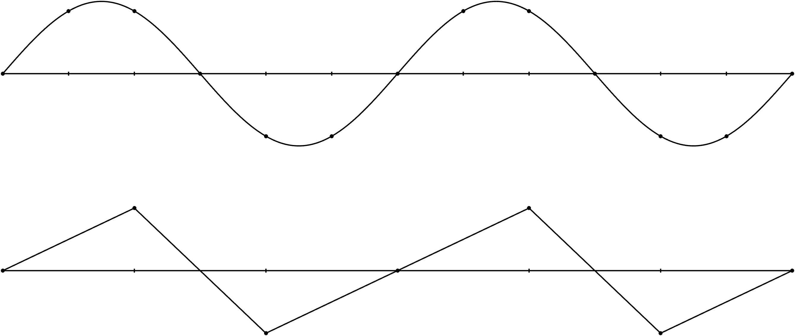

.. _level_smoothers:

===============
Level smoothers
===============

From the last tutorial, we have learned that the used multigrid algorithm may have a significant influence on the convergence speed.
When comparing the error plots for the standalone multigrid smoothers with unsmoothed and smoothed aggregation multigrid,
one finds also a notable difference in the **smoothness** of the error.

Background on multigrid methods
===============================

Obviously, there are cases where some highly oscillatory error modes are left and overlaying some low frequency modes.
In other cases, there are only low frequency error modes left.
Theses are two typical cases one might find in practice.

Multigrid methods are built upont the observation
that (cheap) level smoothing methods often are able to smooth out high oscillatory error components,
whereas they cannot reduce low frequency error components very well.
These low frequency error components are then transferred to a coarse level,
where they can be seen as high frequency error component for a level smoother on the coarse level.

  Image of a sine wave appearing smooth when plotted on a fine mesh and oscillatory when plotted on a coarse mesh.

One should not forget that for an efficient multigrid method both the so-called coarse level correction method and the level smoothers have to work together.
That is, one has to choose the right multigrid method (e.g., **unsmoothed** or **sa**)
in combination with an appropriate level smoothing strategy.

In context of multigrid level smoothers,
we have to define both the level smoother and the coarse solver.
Usually, a direct solver is used as coarse solver that is applied to the coarsest multigrid levels.
However, it is also possible to apply any other kind of iterative smoothing method
or even no solver at all (even though this would be non-standard).
The following XML file shows how to use a Jacobi smoother both for level smoothing and as a coarse solver.

.. literalinclude:: ../../../test/tutorial/s1_easy_jacobi.xml
  :language: xml
  :caption:

:numref:`level_smoothers/figure_1vcycles` and :numref:`level_smoothers/figure_5vcycles`
show the multigrid effect of different number of Jacobi smoothers on all multigrid levels.

.. _level_smoothers/figure_1vcycles:

.. list-table:: 2D Laplace equation on 50 x 50 mesh after 1 V-cycle with an AMG multigrid solver and Jacobi smoothers on all multigrid levels (2 processors, :math:`\omega=0.9`)

  * - .. figure:: pics/1level_1jac09.png

        1 level, 1 Jacobi sweep

    - .. figure:: pics/1level_10jac09.png

        1 level, 10 Jacobi sweeps

    - .. figure:: pics/1level_100jac09.png

        1 level, 100 Jacobi sweeps

  * - .. figure:: pics/2level_1jac09.png

        2 levels, 1 Jacobi sweep

    - .. figure:: pics/2level_10jac09.png

        2 levels, 10 Jacobi sweeps

    - .. figure:: pics/2level_100jac09.png

        2 levels, 100 Jacobi sweeps

  * - .. figure:: pics/3level_1jac09.png

        3 levels, 1 Jacobi sweep

    - .. figure:: pics/3level_10jac09.png

        3 levels, 10 Jacobi sweeps

    - .. figure:: pics/3level_100jac09.png

        3 levels, 100 Jacobi sweeps

.. _level_smoothers/figure_5vcycles:

.. list-table:: 2D Laplace equation on 50 x 50 mesh after 5 V-cycle with an AMG multigrid solver and Jacobi smoothers on all multigrid levels. (2 processors, :math:`\omega=0.9`)

  * - .. figure:: pics/5sweeps_1level_1jac09.png

        1 level, 1 Jacobi sweep

    - .. figure:: pics/5sweeps_1level_10jac09.png

        1 level, 10 Jacobi sweeps

    - .. figure:: pics/5sweeps_1level_100jac09.png

        1 level, 100 Jacobi sweeps

  * - .. figure:: pics/5sweeps_2level_1jac09.png

        2 levels, 1 Jacobi sweep

    - .. figure:: pics/5sweeps_2level_10jac09.png

        2 levels, 10 Jacobi sweeps

    - .. figure:: pics/5sweeps_2level_100jac09.png

        2 levels, 100 Jacobi sweeps

  * - .. figure:: pics/5sweeps_3level_1jac09.png

        3 levels, 1 Jacobi sweep

    - .. figure:: pics/5sweeps_3level_10jac09.png

        3 levels, 10 Jacobi sweeps

    - .. figure:: pics/5sweeps_3level_100jac09.png

        3 levels, 100 Jacobi sweeps

One has even more fine-grained control over pre- and post-smoothing as shown in the following example,
where we use different damping parameters for pre- and post-smoothing (and a direct solver on the coarse grid):

.. literalinclude:: ../../../test/tutorial/s1_easy_jacobi2.xml
  :language: xml
  :caption:

.. note::

    Note that the relaxation-based methods provided by the Ifpack/Ifpack2 package are embedded in an outer additive Schwarz method.

Of course, there exist other smoother methods such as polynomial smoothers (Chebyshev) and ILU-based methods.
A detailed overview of the different available smoothers can be found in the MueLu User's Guide ([1]_).

.. admonition:: Exercise

    Play around with the smoother parameters and study their effect on the error plot and the convergence of the preconditioned CG method.
    For all available smoothing options and parameters refer to the MueLu user guide ([1]_).
    Hint: use **unsmoothed** transfer operator basis functions (i.e., **multigrid algorithm = unsmoothed**)
    to highlight the effect of the level smoothers.

.. admonition:: Exercise

    Use the following parameters to solve the :math:`50\times 50` Laplace 2D problem on 2 processors:

    .. literalinclude:: ../../../test/tutorial/s1_easy_exercise.xml
        :language: xml
        :caption:

  That is, we change to smoothed aggregation AMG (SA-AMG).
  You can find the xml file under the name **s1_easy_exercise.xml**.
  Run the example on two processors and check the number of linear iterations and the solver timings in the screen output.
  Can you find smoother parameters which reduce the number of iterations?
  Can you find smoother parameters which reduce the iteration timings?

Footnotes
=========
.. [1] L. Berger-Vergiat, C. A. Glusa, G. Harper, J. J. Hu, M. Mayr, P. Ohm, A. Prokopenko, C. M. Siefert, R. S. Tuminaro, and T. A. Wiesner. MueLu User's Guide. Technical Report SAND2023-12265, Sandia National Laboratories, Albuquerque, NM (USA) 87185, 2023.
